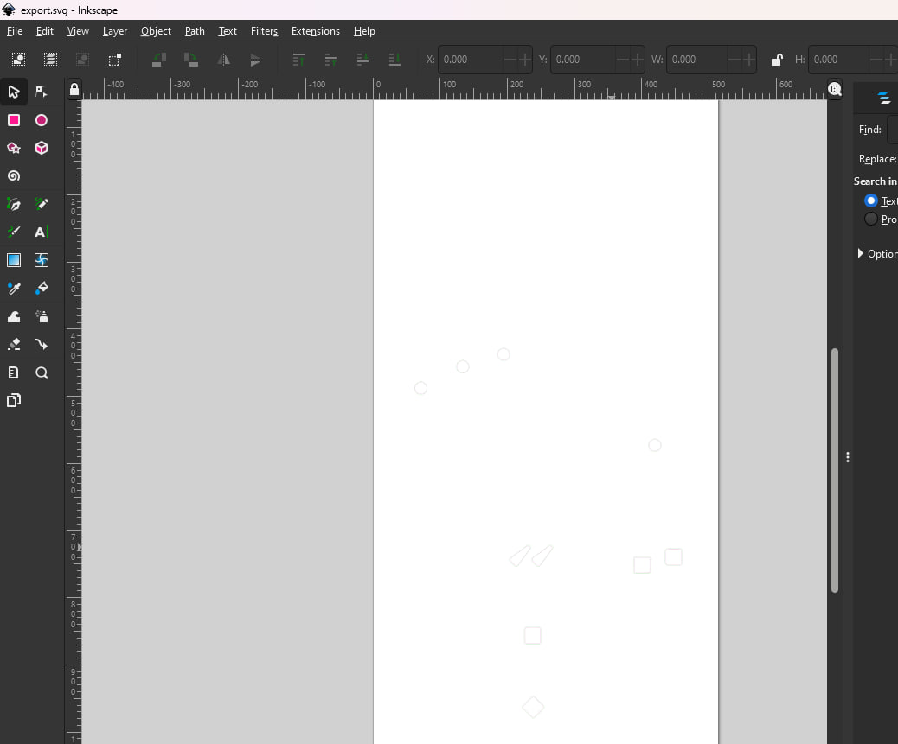

# proc-machine-importer-blend
Converts a `machine.json` for PROC pinball controllers into collections with machine item cuts.
**Requires blender installed. Script was written with `Blender 4.2` and is untested on lower versions.**
## Quick Start
- Run the script using the example `machine.json`. (Windows example below or run the the `generate.bat`)
### Commands (windows examples)
`"C:\Program Files\Blender Foundation\Blender 4.2\Blender.exe" --factory-startup --background --python proc-machine-importer.py`
Playfield dimensions can be given in the arguments after the script `--`, or just adjust the script at the top:

`"C:\Program Files\Blender Foundation\Blender 4.2\Blender.exe" --factory-startup --background --python proc-machine-importer.py -- 514.350 1066.800 12`
## Output
Exported `newfile.blend` file in the same directory

## Add new insert objects
Add a new `.obj` into the `obj_converted` directory and it will be imported with the script and into the `CNC` collection.
To assign a machine item to the object use the same name from the machine config in the `ObjName` property.

The meshes that are in the `*.obj` cuts are two pieces for lights, for leds and lamps to have a lip and 2 outlines.
## Export Svg
- Download the blender addon [Outline To Svg](https://makertales.gumroad.com/l/O2SVG)
- Install the zip in blender preferences / addons and open the properties `N` and you will see a `Svg outline` tab
- Go into top orthographic view with `Num7` and export svg
- You can export by selecting the playfield on its own
- You can export every cut by making them visible and having all of them selected
- TIP: you can just drag the mouse with the button held down to select, instead making visible one by one.
- TIP: to get exact measurements from blender into the outline, make sure everything is correct as far as scaling / precision modelling.
This generated table is already set for this though, the unit scale is `0.001`, metric millimeters.


## Just stroke outline exports
By default there are no options to adjust the stroke or color in the addon.
You can make some adjustments to the script, zip it and reinstall the addon with the changes.

Make the following adjustments in the `write_to_svg.py` add-on script.
There should be two instances of this change

```
# Remove stroke (add stroke)
poly_str = poly_str.replace('stroke-width="2.0"', 'stroke-width="0.1"')
poly_str = poly_str.replace('stroke="#555555"', 'stroke="black"')

## Remove the fill
poly_str = poly_str.replace('fill="#66cc99"', f'fill="none"')
```



